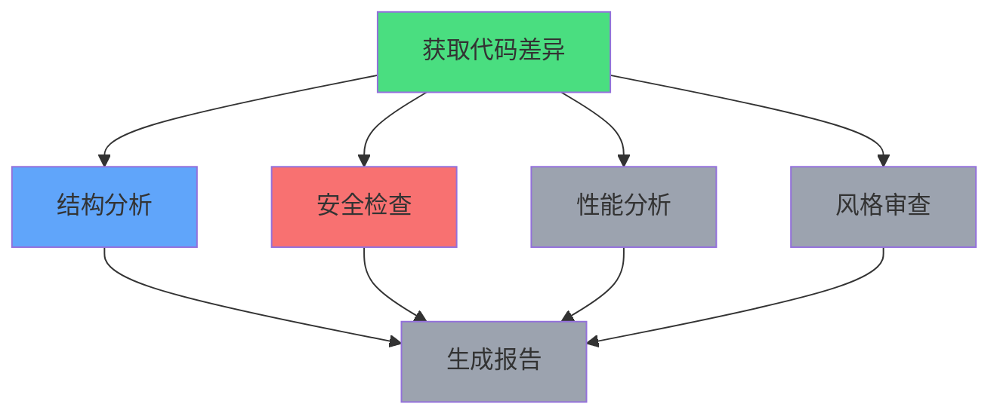

当单个Agent无法完成复杂任务时，我们需要把工作拆成多个步骤，让不同Agent或Skill按特定顺序协作执行。这就涉及工作流编排。编排不是简单的顺序执行，而是要考虑依赖关系、并行可能性、失败回滚和状态同步。这篇文章从DAG和状态机两个核心模型出发，讲清楚Agent工作流编排的工程实践。

## 从顺序执行到工作流编排

最简单的Agent调用是单步的：用户提需求，Agent执行，返回结果。但当任务复杂起来，比如"分析代码、生成测试、运行验证、如果失败则修复再重试"，单步执行就不够用了。

很多人第一反应是把步骤写成代码，用if else和for loop串联。这种方式在小规模时没问题，但扩展性很差。步骤之间的依赖关系被硬编码在代码里，新增一个步骤可能要改多处；失败处理逻辑和正常流程混在一起，越来越难以维护；并行执行需要手动管理线程和同步，容易出错。

工作流编排的核心思想是把"做什么"和"怎么做"分开。DAG或状态机描述"做什么"，即步骤有哪些、它们之间的依赖和条件是什么；执行引擎负责"怎么做"，即调度顺序、并行策略、失败重试和资源分配。

这种分离带来几个好处。一是可视化，工作流结构可以用图表示，团队沟通更直观。二是可复用，同一个DAG定义可以用不同的执行引擎跑。三是可扩展，新增步骤不需要改现有代码，只需要在图中添加节点和边。四是可观测，执行状态天然适合监控和追踪。

## DAG模型：用有向无环图描述依赖

DAG是工作流编排中最常用的模型。节点代表执行步骤，有向边代表依赖关系。无环意味着不存在循环依赖，这保证了工作流总能终止。

一个典型的代码审查工作流DAG可能长这样：

```yaml
# 代码审查工作流DAG定义
workflow:
  name: code-review-pipeline
  nodes:
    - id: fetch-diff
      type: skill
      skillId: git-diff-fetcher
    
    - id: analyze-structure
      type: skill
      skillId: code-structure-analyzer
    
    - id: check-security
      type: skill
      skillId: security-scanner
    
    - id: check-performance
      type: skill
      skillId: performance-analyzer
    
    - id: review-style
      type: skill
      skillId: style-reviewer
    
    - id: generate-report
      type: skill
      skillId: report-generator
  
  edges:
    - from: fetch-diff
      to: [analyze-structure, check-security, check-performance, review-style]
    
    - from: [analyze-structure, check-security, check-performance, review-style]
      to: generate-report
```

这个DAG表示：先获取代码差异，然后并行做结构分析、安全检查、性能分析和风格审查，最后等前面四个步骤都完成后生成报告。

DAG的执行引擎需要解决两个核心问题：拓扑排序和并行调度。拓扑排序确定步骤的合法执行顺序，并行调度则决定哪些没有依赖关系的步骤可以同时跑。

```python
# 拓扑排序与并行调度示例
from collections import deque

class DAGExecutor:
    def __init__(self, workflow):
        self.workflow = workflow
        self.in_degree = self._compute_in_degrees()
        self.node_outputs = {}
    
    def _compute_in_degrees(self):
        in_degree = {node.id: 0 for node in self.workflow.nodes}
        for edge in self.workflow.edges:
            for target in edge.to if isinstance(edge.to, list) else [edge.to]:
                in_degree[target] += 1
        return in_degree
    
    def execute(self):
        queue = deque([nid for nid, deg in self.in_degree.items() if deg == 0])
        
        while queue:
            # 当前可以并行执行的所有节点
            ready_nodes = list(queue)
            queue.clear()
            
            # 并行执行
            results = self._execute_parallel(ready_nodes)
            
            # 更新下游节点的入度
            for node_id, output in results.items():
                self.node_outputs[node_id] = output
                for edge in self.workflow.edges:
                    if edge.from == node_id:
                        for target in edge.to if isinstance(edge.to, list) else [edge.to]:
                            self.in_degree[target] -= 1
                            if self.in_degree[target] == 0:
                                queue.append(target)
```

DAG的优势是表达能力强，能清晰描述复杂的依赖网络。但它也有局限。DAG假设依赖关系是静态的，执行前就能确定。而有些场景需要根据中间结果动态决定下一步，比如"如果测试失败就修复代码，否则直接发布"，这种条件分支用DAG表达会比较别扭。

## 状态机模型：用状态和事件驱动流程

状态机是另一种常用的工作流模型。它用状态节点和转移边描述流程，转移由事件触发。相比DAG，状态机更擅长表达条件分支和循环。

一个发布流程的状态机可能包含这些状态：待分析、分析中、待实现、实现中、待测试、测试中、待发布、已发布。每个状态的转移条件各不相同。

```typescript
// 状态机定义示例
interface StateMachine {
  initialState: string;
  states: Record<string, State>;
}

interface State {
  onEnter?: (ctx: ExecutionContext) => Promise<void>;
  onExit?: (ctx: ExecutionContext) => Promise<void>;
  transitions: Transition[];
}

interface Transition {
  event: string;
  target: string;
  condition?: (ctx: ExecutionContext) => boolean;
  action?: (ctx: ExecutionContext) => Promise<void>;
}

const releaseWorkflow: StateMachine = {
  initialState: 'pending_analysis',
  states: {
    pending_analysis: {
      transitions: [
        { event: 'start', target: 'analyzing' }
      ]
    },
    analyzing: {
      onEnter: async (ctx) => {
        ctx.result = await ctx.agent.run('analyze-requirements', ctx.input);
      },
      transitions: [
        { event: 'complete', target: 'pending_implementation' },
        { event: 'fail', target: 'failed' }
      ]
    },
    pending_implementation: {
      transitions: [
        { event: 'start', target: 'implementing' }
      ]
    },
    implementing: {
      onEnter: async (ctx) => {
        ctx.result = await ctx.agent.run('implement-feature', ctx.result);
      },
      transitions: [
        { event: 'complete', target: 'pending_testing' },
        { event: 'fail', target: 'failed' }
      ]
    },
    pending_testing: {
      transitions: [
        { event: 'start', target: 'testing' }
      ]
    },
    testing: {
      onEnter: async (ctx) => {
        ctx.result = await ctx.agent.run('run-tests', ctx.result);
      },
      transitions: [
        { 
          event: 'complete', 
          target: 'pending_release',
          condition: (ctx) => ctx.result.allPassed
        },
        { 
          event: 'complete', 
          target: 'pending_fix',
          condition: (ctx) => !ctx.result.allPassed
        },
        { event: 'fail', target: 'failed' }
      ]
    },
    pending_fix: {
      transitions: [
        { event: 'start', target: 'implementing' }
      ]
    },
    pending_release: {
      transitions: [
        { event: 'release', target: 'released' }
      ]
    },
    released: {
      onEnter: async (ctx) => {
        await ctx.agent.run('notify-team', { status: 'released' });
      },
      transitions: []
    },
    failed: {
      onEnter: async (ctx) => {
        await ctx.agent.run('handle-failure', ctx.error);
      },
      transitions: []
    }
  }
};
```

状态机的执行引擎负责管理当前状态、监听事件、评估转移条件和执行状态动作。

```typescript
class StateMachineExecutor {
  private currentState: string;
  private context: ExecutionContext;
  
  constructor(private machine: StateMachine, context: ExecutionContext) {
    this.currentState = machine.initialState;
    this.context = context;
  }
  
  async start() {
    await this._enterState(this.currentState);
  }
  
  async send(event: string) {
    const state = this.machine.states[this.currentState];
    const transition = state.transitions.find(t => t.event === event);
    
    if (!transition) return;
    if (transition.condition && !transition.condition(this.context)) return;
    
    await this._exitState(this.currentState);
    if (transition.action) await transition.action(this.context);
    
    this.currentState = transition.target;
    await this._enterState(this.currentState);
  }
  
  private async _enterState(stateId: string) {
    const state = this.machine.states[stateId];
    if (state.onEnter) await state.onEnter(this.context);
    
    // 自动触发无条件的转移
    const autoTransition = state.transitions.find(t => t.event === 'auto');
    if (autoTransition) {
      await this.send('auto');
    }
  }
}
```

状态机的一个关键优势是表达循环和条件分支很自然。测试失败回到修复状态再重新测试，这种循环在DAG里需要特殊处理，在状态机里就是两条转移边。但状态机不擅长表达并行，多个独立步骤同时执行的状态机模型会变得很复杂。

## 混合模型：DAG与状态机的结合

实际工程中，单一模型往往不够。更好的做法是分层：用状态机管理高层流程阶段，每个阶段内部用DAG执行具体的并行步骤。

比如一个完整的软件交付流程，顶层用状态机管理：需求分析 -> 设计 -> 开发 -> 测试 -> 发布。在开发阶段内部，用DAG并行执行：接口设计、数据库建模、核心逻辑实现、单元测试编写。在测试阶段内部，用DAG并行执行：单元测试、集成测试、安全扫描、性能基准测试。

```yaml
# 混合模型示例
workflow:
  type: state-machine
  states:
    development:
      type: dag
      nodes:
        - id: design-api
        - id: design-db
        - id: implement-core
        - id: write-tests
      edges:
        - from: [design-api, design-db]
          to: implement-core
        - from: implement-core
          to: write-tests
    
    testing:
      type: dag
      nodes:
        - id: unit-tests
        - id: integration-tests
        - id: security-scan
        - id: performance-baseline
      edges:
        - from: unit-tests
          to: [integration-tests, security-scan, performance-baseline]
```

这种分层架构的好处是清晰。状态机负责流程的骨架和决策点，DAG负责具体工作的编排。团队可以独立优化每个DAG，而不影响整体流程。

## 条件分支与动态路由

工作流中的条件分支有两种实现方式。一种是静态条件，执行前就能确定走哪条分支；另一种是动态条件，需要根据前面步骤的结果决定。

静态条件可以用DAG表达，把工作流拆成多个子图，根据输入参数选择对应的子图。动态条件更适合状态机，或者DAG中的条件网关节点。

```yaml
# 条件网关示例
nodes:
  - id: evaluate-risk
    type: skill
    skillId: risk-evaluator
  
  - id: high-risk-review
    type: skill
    skillId: senior-reviewer
  
  - id: standard-review
    type: skill
    skillId: standard-reviewer
  
  - id: condition-gateway
    type: condition
    branches:
      - condition: evaluate-risk.score > 80
        to: high-risk-review
      - condition: evaluate-risk.score <= 80
        to: standard-review
```

条件网关的实现难点在于类型安全。如果条件表达式引用了不存在的节点输出，或者类型不匹配，应该在定义阶段就报错，而不是执行时才暴露。

```typescript
// 条件表达式类型检查
class ConditionChecker {
  check(nodeOutputs: Map<string, Type>, condition: string): TypeCheckResult {
    // 解析条件表达式
    const refs = this.extractReferences(condition);
    
    // 验证所有引用都存在
    for (const ref of refs) {
      if (!nodeOutputs.has(ref.nodeId)) {
        return { valid: false, error: `Node ${ref.nodeId} not found` };
      }
      
      const outputType = nodeOutputs.get(ref.nodeId);
      if (!this.isCompatible(outputType, ref.field)) {
        return { valid: false, error: `Field ${ref.field} not found in ${ref.nodeId}` };
      }
    }
    
    return { valid: true };
  }
}
```

动态路由的另一个挑战是后续步骤的输入类型。如果不同分支的输出结构不同，合并到同一条后续边时可能需要做类型转换或字段映射。

## 并行执行与资源管理

并行执行是提升工作流效率的关键，但也引入了新的复杂性：资源竞争、死锁、超时和结果合并。

资源竞争发生在多个并行步骤需要访问同一个外部系统时。比如三个Skill同时调用同一个LLM API，可能触发速率限制。解决方法是在执行引擎里引入资源配额和令牌桶限流。

```typescript
// 资源配额管理
class ResourceQuota {
  private tokens: Map<string, Semaphore> = new Map();
  
  async acquire(resourceId: string, permits: number = 1): Promise<ReleaseFn> {
    if (!this.tokens.has(resourceId)) {
      this.tokens.set(resourceId, new Semaphore(this.getLimit(resourceId)));
    }
    
    const semaphore = this.tokens.get(resourceId);
    await semaphore.acquire(permits);
    
    return () => semaphore.release(permits);
  }
}

// 在DAG执行器中使用
async _execute_parallel(nodeIds: string[]) {
  const releaseFns: ReleaseFn[] = [];
  
  try {
    // 先获取所有需要的资源
    for (const nodeId of nodeIds) {
      const resources = this.getResourceRequirements(nodeId);
      for (const res of resources) {
        const release = await this.quota.acquire(res.id, res.amount);
        releaseFns.push(release);
      }
    }
    
    // 并行执行
    return await Promise.allSettled(
      nodeIds.map(id => this.executeNode(id))
    );
  } finally {
    // 释放资源
    for (const release of releaseFns) {
      release();
    }
  }
}
```

死锁在DAG中不常见，因为DAG本身无环。但在混合模型中，如果状态机的某个转移条件等待另一个状态机的事件，就可能出现循环等待。避免死锁的原则是：永远不要让一个步骤的完成条件依赖于它自己的输出。

超时管理也很重要。并行步骤中如果某一个卡住了，不应该无限等待。应该为每个步骤设置合理的超时时间，超时后标记为失败，触发回滚或降级。

```yaml
# 超时与重试配置
nodes:
  - id: llm-generation
    type: skill
    skillId: text-generator
    timeout: 60s
    retries:
      maxAttempts: 3
      backoff: exponential
      initialDelay: 1s
      maxDelay: 10s
    onTimeout: fallback-to-cache
    onFailure: skip-and-warn
```

## 依赖管理与数据传递

工作流步骤之间的数据传递有两种模式：推模式和拉模式。

推模式是上游步骤主动把输出推给下游。简单直接，但耦合度高，上游需要知道下游需要什么。拉模式是下游步骤从共享上下文中读取需要的数据。解耦性好，但容易出现命名冲突和数据竞争。

建议采用混合模式：每个步骤的输出按命名规范写入上下文，下游步骤通过声明式的方式引用需要的输入。

```yaml
# 声明式数据引用
nodes:
  - id: fetch-data
    output:
      users: "$.data.users"
      total: "$.data.total"
  
  - id: process-users
    input:
      users: "fetch-data.users"
      batchSize: 100
  
  - id: generate-summary
    input:
      total: "fetch-data.total"
      processed: "process-users.count"
```

这种声明式引用可以被执行引擎静态分析，在运行前检查所有引用是否都有对应的输出，避免运行时才发现数据缺失。

对于大数据量的传递，不建议直接通过上下文序列化传输。可以用引用传递，上下文只保存数据标识符，实际数据存在对象存储中，需要时按需读取。

## 可视化与可观测性

工作流编排的另一个重要方面是可视化。团队需要看到工作流的结构、当前执行状态和 history。

工作流结构可以用Mermaid或Graphviz渲染。执行状态可以用不同颜色标识节点状态：灰色是未开始，蓝色是运行中，绿色是成功，红色是失败，黄色是等待依赖。



可观测性方面，每个工作流执行都应该生成一个trace，包含所有步骤的开始时间、结束时间、输入输出摘要和资源使用情况。这些trace不仅用于调试，也用于后续优化：哪些步骤总是超时，哪些步骤可以并行但没有并行，哪些路径是瓶颈。

## 实际案例：自动化内容发布流水线

我们团队的内容发布流程是一个典型的混合工作流。当作者提交一篇文章后，工作流自动启动。

状态机层面有三个主要阶段：内容处理、质量检查、发布部署。

在内容处理阶段，内部DAG并行执行：提取元数据、生成摘要、优化图片、检查内部链接。这些步骤互不依赖，可以并行。

在质量检查阶段，内部DAG先串行执行语法检查，然后并行执行SEO检查、可读性分析和事实核查。语法检查必须先完成，因为后面的检查都依赖它的输出。

在发布部署阶段，根据前面阶段的结果决定走哪条分支。如果所有检查通过，直接构建并部署；如果有警告，发送通知等待人工确认；如果有严重错误，退回给作者修改。

```typescript
// 发布流程的执行日志片段
{
  "workflowId": "publish-2025-12-24-001",
  "startTime": "2025-12-24T09:00:00Z",
  "stages": [
    {
      "stage": "content-processing",
      "parallelSteps": [
        { "step": "extract-metadata", "duration": "0.3s", "status": "success" },
        { "step": "generate-summary", "duration": "2.1s", "status": "success" },
        { "step": "optimize-images", "duration": "5.4s", "status": "success" },
        { "step": "check-links", "duration": "3.2s", "status": "success" }
      ]
    },
    {
      "stage": "quality-check",
      "steps": [
        { "step": "grammar-check", "duration": "1.5s", "status": "success", "issues": 2 },
        { "step": "seo-check", "duration": "0.8s", "status": "success", "score": 92 },
        { "step": "readability-check", "duration": "0.6s", "status": "success", "grade": "A" },
        { "step": "fact-check", "duration": "4.2s", "status": "success", "flags": 0 }
      ]
    },
    {
      "stage": "deploy",
      "decision": "auto-deploy",
      "duration": "12.3s",
      "status": "success",
      "url": "https://blog.example.com/posts/new-article"
    }
  ],
  "totalDuration": "30.4s"
}
```

这个流程用纯串行执行大概需要90秒，通过DAG并行优化后降到30秒。更重要的是，所有步骤都有明确的依赖关系，不会出现"还没检查完就发布了"这类人为失误。

## 总结与最佳实践

Agent工作流编排的核心是选择合适的模型并分层设计。DAG适合表达并行依赖，状态机适合表达条件分支和循环。实际系统中建议混合使用，状态机管阶段，DAG管具体工作。

在设计工作流时，遵循这些原则。步骤拆分要适度，太细会增加调度开销，太粗会失去并行优化的空间。依赖关系要明确，避免隐式依赖导致执行顺序不确定。失败处理要完整，每个步骤都要有超时、重试和降级策略。数据传递要规范，用声明式引用代替隐式共享。

在执行层面，重视资源管理。并行步骤要有限流保护，避免下游系统被压垮。重视可观测性，每个执行都要有完整的trace和日志。重视幂等性，同一个工作流多次触发不应该产生副作用。

最后，工作流定义本身也要版本管理。修改工作流结构是高风险操作，应该像代码一样走review流程，支持灰度发布和快速回滚。把工作流当成基础设施而不是临时脚本，才能真正发挥编排的价值。